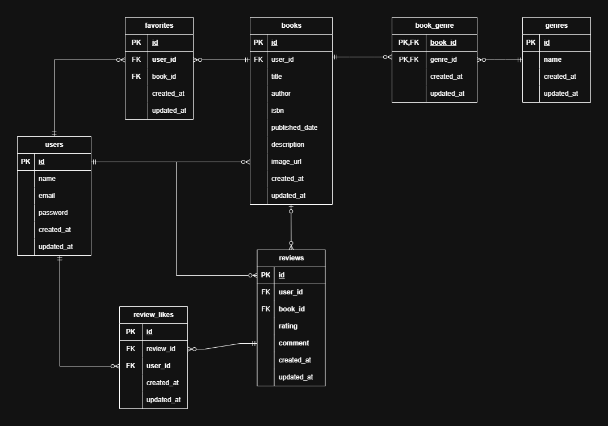

# BookShelf 書籍レビューアプリ

## 概要
COACHTECH 模擬案件にて作成した成果物です。(バックエンド部分のみ)
会員登録したユーザーが書籍を登録し、他のユーザーがその書籍をお気に入りに追加したりレビューできる書籍レビューアプリです。
レビュー評価をもとにしたランキング機能も備えており、人気の本を簡単に見つけられます。

## 機能一覧
- 認証機能
- 書籍登録機能 (CRUD)
- レビュー機能
- 書籍のお気に入り機能
- レビューのいいね機能
- ランキング機能
- 公開API (書籍の登録、データの取得等)

## 使用技術
- PHP 8.5
- Laravel 10.x
- Laravel Sail (Docker)
- Laravel Fortify
- Tailwind css
- MySQL 8.4
- phpMyAdmin

## 環境構築

### 必要なツール
- Docker Desktop
- Git
- テキストエディタ

### 1. リポジトリをクローン
git clone https://github.com/omu-39/bookshelf-app.git

### 2. ディレクトリ移動
cd bookshelf-app-git

### 3. Sailを含む依存パッケージのインストール
docker run --rm \
    -u "$(id -u):$(id -g)" \
    -v "$(pwd):/var/www/html" \
    -w /var/www/html \
    -e COMPOSER_CACHE_DIR=/tmp/composer_cache \
    laravelsail/php82-composer:latest \
    composer install

### 4. 環境変数を設定
cp .env.example .env

### 5. Sailの起動
./vendor/bin/sail up -d

### 6. アプリケーションキーの生成
./vendor/bin/sail artisan key:generate

### 7. DBのセットアップ
./vendor/bin/sail artisan migrate --seed

### 8. NPM依存パッケージのインストール
./vendor/bin/sail npm install

### 9. Alpine.jsのインストール
./vendor/bin/sail npm install alpinejs

### 10. Tailwind CSSのインストール
./vendor/bin/sail npm install

### 11. CSS/JSのビルド
- 本番用
./vendor/bin/sail npm run build

- 開発用
./vendor/bin/sail npm run dev


## ER図


## テストアカウント
name:山田太郎 (書籍登録者)
email:yamada@example.com
password:password
------------------------------
name:鈴木花子
email:suzuki@example.com
password:password
------------------------------
name:田中一郎
email:tanaka@example.com
password:password
------------------------------
name:佐藤美咲
email:sato@example.com
password:password
------------------------------
name:高橋健太
email:takahashi@example.com
password:password
------------------------------

※初期データとして山田太郎のアカウントで書籍を11件登録しております。

## URL
- `http://localhost:8080` : phpMyAdmin

### Web画面
- `http://localhost/books` : 書籍一覧
- `http://localhost/books/{book}` : 書籍詳細
- `http://localhost/books/create` : 書籍登録フォーム（ログイン時）
- `http://localhost/books/{book}/edit` : 書籍編集フォーム（ログイン時）
- `http://localhost/books/{book}/reviews` : レビュー投稿（ログイン時）
- `http://localhost/reviews/{review}/edit` : レビュー編集フォーム（ログイン時）
- `http://localhost/reviews/{review}/like` : レビューいいね（ログイン時）
- `http://localhost/favorites` : お気に入り一覧（ログイン時）
- `http://localhost/books/{book}/favorite` : お気に入り切り替え（ログイン時）
- `http://localhost/genres` : ジャンル一覧（ログイン時）
- `http://localhost/genres/create` : ジャンル登録フォーム（ログイン時）
- `http://localhost/genres/{genre}` : ジャンル詳細（ログイン時）
- `http://localhost/genres/{genre}/edit` : ジャンル編集フォーム（ログイン時）
- `http://localhost/ranking` : レビューランキング一覧

※ `{book}` や `{genre}`、`{review}` には実際の ID を入れて使用します。

## 公開API

### 提供する機能
- 書籍データの取得
- 書籍一覧取得時の絞込機能
- 書籍登録
- 書籍更新
- 書籍削除

### エンドポイント一覧
- `http://localhost/api/v1/books` : 書籍一覧取得
- `http://localhost/api/v1/books/{book}` : 書籍詳細取得
- `http://localhost/api/v1/books` : 書籍作成（POST）
- `http://localhost/api/v1/books/{book}` : 書籍更新（PUT/PATCH）
- `http://localhost/api/v1/books/{book}` : 書籍削除（DELETE）

### 一覧取得時の絞込機能
書籍一覧取得では、クエリパラメータを付けることで検索結果を絞り込めます。

- `keyword` : タイトルに対して部分一致検索を行います。
  - 例: `http://localhost/api/v1/books?keyword=Laravel`
- `genres` : ジャンル名の配列で絞り込みます。
  - 例: `http://localhost/api/v1/books?genres[]=PHP&genres[]=Web`
- `page` : 取得するページ番号を指定します。
- `per_page` : 1ページあたりの表示件数を指定します。
  - 例: `http://localhost/api/v1/books?per_page=10`

### 各APIのリクエスト例・レスポンス例

#### 1. 書籍一覧取得
- Method: `GET`
- Endpoint: `http://localhost/api/v1/books`
- Request example:
  - `http://localhost/api/v1/books?keyword=Laravel&per_page=5`
- Response JSON example:
```json
{
  "data": [
    {
      "id": 1,
      "user": "山田太郎",
      "title": "Laravel入門",
      "author": "山田太郎",
      "image_url": "https://example.com/image.jpg",
      "genres": [
        {
          "id": 1,
          "name": "PHP"
        }
      ],
      "average_rating": 4.5,
      "reviews_count": 3
    }
  ],
  "links": {
    "first": "http://localhost/api/v1/books?page=1",
    "last": "http://localhost/api/v1/books?page=2",
    "prev": null,
    "next": "http://localhost/api/v1/books?page=2"
  },
  "meta": {
    "current_page": 1,
    "from": 1,
    "last_page": 2,
    "path": "http://localhost/api/v1/books",
    "per_page": 5,
    "to": 5,
    "total": 11
  }
}
```

#### 2. 書籍詳細取得
- Method: `GET`
- Endpoint: `http://localhost/api/v1/books/{book}`
- Response JSON example:
```json
{
  "data": {
    "id": 1,
    "user": "山田太郎",
    "title": "Laravel入門",
    "author": "山田太郎",
    "isbn": "9781234567890",
    "published_date": "2024-01-01",
    "description": "Laravelの基礎を学べる書籍です。",
    "image_url": "https://example.com/image.jpg",
    "genres": [
      {
        "id": 1,
        "name": "PHP"
      }
    ],
    "reviews": [
      {
        "id": 1,
        "user": "佐藤花子",
        "rating": 5,
        "comment": "とても勉強になりました。",
        "created_at" :"2026-05-04"
      }
    ],
  }
}
```

#### 3. 書籍作成
- Method: `POST`
- Endpoint: `http://localhost/api/v1/books`
- Request body example:
```json
{
  "user_id": 1,
  "title": "Laravel実践",
  "author": "佐藤花子",
  "isbn": "9789876543210",
  "published_date": "2024-06-01",
  "description": "実務向けのLaravel解説書です。",
  "image_url": "https://example.com/image.jpg",
  "genres": ["PHP", "Web"]
}
```
- Response JSON example:
```json
{
  "data": {
    "id": 12,
    "user": "山田太郎",
    "title": "Laravel実践",
    "author": "佐藤花子",
    "isbn": "9789876543210",
    "published_date": "2024-06-01",
    "description": "実務向けのLaravel解説書です。",
    "image_url": "https://example.com/image.jpg",
    "genres": [
      {
        "id": 1,
        "name": "PHP"
      },
      {
        "id": 2,
        "name": "Web"
      }
    ],
  }
}
```

#### 4. 書籍更新
- Method: `PUT` or `PATCH`
- Endpoint: `http://localhost/api/v1/books/{book}`
- Request body example:
```json
{
  "user_id": 1,
  "title": "Laravel実践改訂版",
  "author": "佐藤花子",
  "isbn": "9789876543211",
  "published_date": "2024-06-02",
  "description": "改訂版です。",
  "image_url": "https://example.com/image2.jpg",
  "genres": ["PHP", "Web"]
}
```
- Response JSON example:
```json
{
  "data": {
    "id": 12,
    "user": "山田太郎",
    "title": "Laravel実践改訂版",
    "author": "佐藤花子",
    "isbn": "9789876543211",
    "published_date": "2024-06-02",
    "description": "改訂版です。",
    "image_url": "https://example.com/image2.jpg",
    "genres": [
      {
        "id": 1,
        "name": "PHP"
      },
      {
        "id": 2,
        "name": "Web"
      }
    ],
  }
}
```

#### 5. 書籍削除
- Method: `DELETE`
- Endpoint: `http://localhost/api/v1/books/{book}`
- Response:
  - Status: `204 No Content`
  - Body: none

※ `{book}` には実際の ID を入れて使用します。
