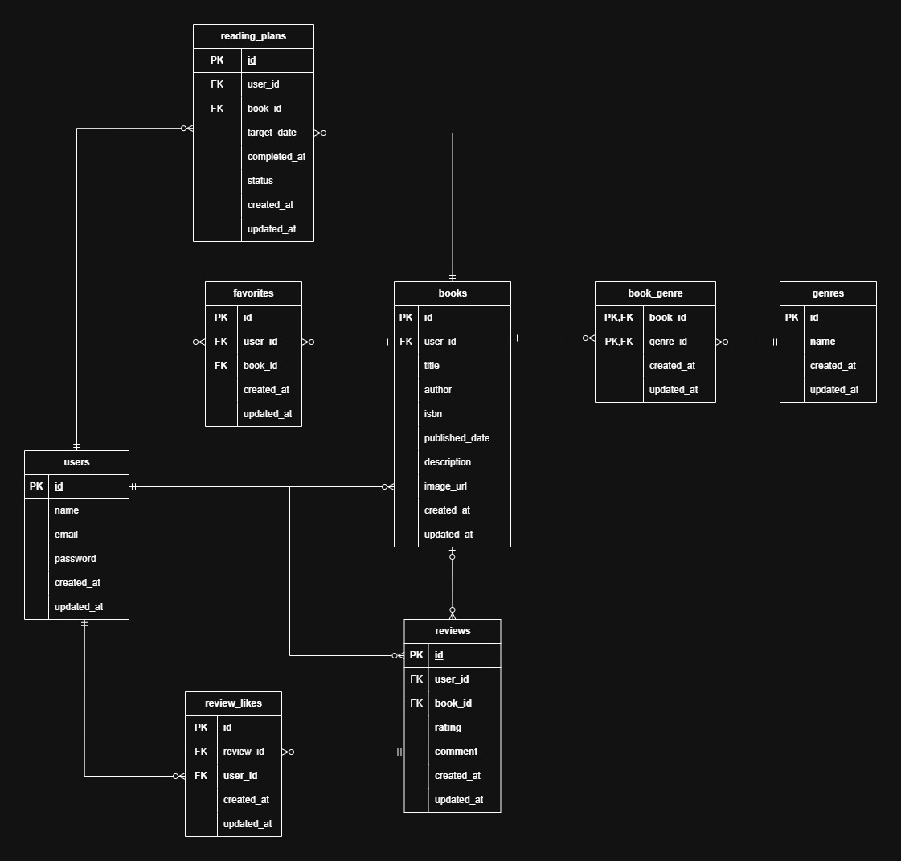

# BookShelf 書籍レビューアプリ

## 概要

COACHTECH 模擬案件にて作成した成果物です。(バックエンド部分のみ)
会員登録したユーザーが書籍を登録し、他のユーザーがその書籍をお気に入りに追加したりレビューできる書籍レビューアプリです。
レビュー評価をもとにしたランキング機能も備えており、人気の本を簡単に見つけられます。

## 機能一覧

### 認証・ユーザー管理

- ユーザー登録・ログイン・ログアウト機能
- Laravel Sanctumを使用したAPIトークン認証

### 書籍管理

- 書籍のCRUD機能
- Google Books APIを利用したISBN検索・書籍情報取得機能
- 書籍一覧検索機能（キーワード検索・ジャンル検索・ソート）
- 書籍のお気に入り機能
- 書籍評価ランキング機能

### レビュー機能

- レビュー投稿・編集・削除機能
- レビューいいね機能

### 読書計画管理

- 読書期限を設定した読書計画の作成・更新・削除・読了管理
- `reading-plans:check`コマンドによる読書計画のステータス更新・リマインダー通知の即時実行
- Laravel Schedulerによる定期的な読書計画チェック・通知処理

### 通知機能

- 通知一覧表示
- 通知既読処理

### レポート機能

- マイ書籍レポート画面
    - 総レビュー数
    - 読了冊数
    - 平均評価
    - 評価分布
    - 高評価書籍TOP5などの集計表示

### 権限管理

- 所有者のみ編集・削除可能な認可制御
    - 書籍
    - レビュー
    - 読書計画

### API機能

- REST APIの実装
    - ログインAPI
    - 書籍CRUD API

## 使用技術

### Frontend

- Blade
- JavaScript
- Tailwind css
- Alpine.js
- Vite

### Backend

- PHP 8.5
- Laravel 10.x
- Laravel Fortify
- Laravel Sanctum
- Laravel Scheduler
- Laravel Artisan Command
- PHPUnit

### Database

- MySQL 8.4

### Database Management Tool

- phpMyAdmin

### Infrastracture

- Docker
- Laravel Sail

### External API

- Google Books API

## 環境構築

### 必要なツール

- Docker Desktop
- Git
- テキストエディタ (VSCode推奨)

※ Windows をお使いの場合は WSL2 の利用を推奨します。Apple Silicon の Mac でプラットフォームエラーが出る場合は、`compose.yaml` の該当サービスに `platform: linux/amd64` を追記してください。

### 1. リポジトリをクローン

```bash
git clone https://github.com/omu-39/bookshelf-app.git
```

### 2. ディレクトリ移動

```bash
cd bookshelf-app-git
```

### 3. Sailを含む依存パッケージのインストール

```bash
docker run --rm \
  -u "$(id -u):$(id -g)" \
  -v "$(pwd):/var/www/html" \
  -w /var/www/html \
  -e COMPOSER_CACHE_DIR=/tmp/composer_cache \
  laravelsail/php82-composer:latest \
  composer install
```

### 4. 環境変数を設定

```bash
cp .env.example .env
```

### 5. Sailの起動

```bash
./vendor/bin/sail up -d
```

### 6. アプリケーションキーの生成

```bash
./vendor/bin/sail artisan key:generate
```

### 7. DBのセットアップ

```bash
./vendor/bin/sail artisan migrate --seed
```

### 8. NPM依存パッケージのインストール

```bash
./vendor/bin/sail npm install
```

### 9. Alpine.jsのインストール

```bash
./vendor/bin/sail npm install alpinejs
```

### 10. Tailwind CSSのインストール

```bash
./vendor/bin/sail npm install
```

### 11. CSS/JSのビルド

- 本番用

```bash
./vendor/bin/sail npm run build
```

- 開発用

```bash
./vendor/bin/sail npm run dev
```

## Artisan Command

読書計画の状態更新・通知処理を手動実行できます。

```bash
./vendor/bin/sail artisan reading-plans:check
```

## テスト実行

以下のコマンドでテストを実行できます。

```bash
./vendor/bin/sail artisan test
```

テストカバレッジを確認する場合は以下のコマンドで確認できます。

```bash
./vendor/bin/sail artisan test --coverage
```

## ER図



## 初期データ

### テストアカウント

name:山田太郎 (書籍登録者)
email:yamada@example.com
password:password

---

name:鈴木花子
email:suzuki@example.com
password:password

---

name:田中一郎
email:tanaka@example.com
password:password

---

name:佐藤美咲
email:sato@example.com
password:password

---

name:高橋健太
email:takahashi@example.com
password:password

---

### 書籍一覧

- 吾輩は猫である / 夏目漱石
- 人を動かす / D・カーネギー
- リーダブルコード / Dustin Boswell
- 7つの習慣 / スティーブン・R・コヴィー
- 坊っちゃん / 夏目漱石
- サピエンス全史 / ユヴァル・ノア・ハラリ
- Clean Code / Robert C. Martin
- 嫌われる勇気 / 岸見一郎・古賀史健
- 火花 / 又吉直樹
- FACTFULNESS / ハンス・ロスリング
- コンテナ物語 / マルク・レビンソン

※それぞれの書籍を登録したユーザーはテストアカウントからランダムに選択されます。

### ジャンル一覧

- 小説
- ビジネス
- 技術書
- 自己啓発
- エッセイ
- 歴史
- 科学
- 芸術
- 料理
- 旅行

### 読書計画一覧 (例)

- 山田太郎の読書計画は、通知機能・自動更新の確認のため、全パターン生成されます。
- 山田太郎以外のユーザーには、それぞれ1件ずつランダムな読書計画が生成されます。

- 山田太郎 / 吾輩は猫である / 期日: 3日前 / 状態: 進行中
- 山田太郎 / リーダブルコード / 期日: 前日 / 状態: 進行中
- 山田太郎 / 7つの習慣 / 期日: 今日 / 状態: 進行中
- 山田太郎 / Clean Code / 期日: 3日後 / 状態: 進行中
- 山田太郎 / Clean Code / 期日: 4日後以降 / 状態: 進行中
- 山田太郎 / Clean Code / 期日: 4日後以降 / 状態: 読了
- 鈴木花子 / 人を動かす / 期日: ランダム / 状態: ランダム
- 田中一郎 / サピエンス全史 / 期日: ランダム / 状態: ランダム
- 佐藤美咲 / 嫌われる勇気 / 期日: ランダム / 状態: ランダム
- 高橋健太 / FACTFULNESS / 期日: ランダム / 状態: ランダム

- `reading-plans:check`コマンドを利用する事で状態の自動更新・リマインダー通知の発火をテストできます。

## URL

- `http://localhost:8080` : phpMyAdmin

### Web画面

- `http://localhost/register` : 会員登録
- `http://localhost/login` : ログイン
- `http://localhost/logout` : ログアウト
- `http://localhost/books` : 書籍一覧 (トップページ)
- `http://localhost/books/{book}` : 書籍詳細
- `http://localhost/books/create` : 書籍登録フォーム（ログイン時）
- `http://localhost/books/{book}/edit` : 書籍編集フォーム（ログイン時）
- `http://localhost/books/{book}/reviews` : レビュー投稿（ログイン時）
- `http://localhost/reviews/{review}/edit` : レビュー編集フォーム（ログイン時）
- `http://localhost/reviews/{review}/like` : レビューいいね（ログイン時）
- `http://localhost/favorites` : お気に入り一覧（ログイン時）
- `http://localhost/books/{book}/favorite` : お気に入り切り替え（ログイン時）
- `http://localhost/genres` : ジャンル一覧（ログイン時）
- `http://localhost/genres/create` : ジャンル登録フォーム（ログイン時）
- `http://localhost/genres/{genre}` : ジャンル詳細（ログイン時）
- `http://localhost/genres/{genre}/edit` : ジャンル編集フォーム（ログイン時）
- `http://localhost/ranking` : レビューランキング一覧
- `http://localhost/reports` : マイ書籍レポート（ログイン時）
- `http://localhost/reading-plans` : 読書計画一覧（ログイン時）
- `http://localhost/reading-plans/create` : 読書計画作成フォーム（ログイン時）
- `http://localhost/reading-plans/{plan}/edit` : 読書計画編集フォーム（ログイン時）
- `http://localhost/notifications` : 通知一覧（ログイン時）

※ `{book}` や `{genre}`、`{review}` 等にはオブジェクトの ID が入ります。

## 公開API

### 提供する機能

- ログインAPI (トークン取得API)
- 書籍データの取得
- 書籍一覧取得時の絞込機能
- 書籍登録 (トークン認証必須)
- 書籍更新 (トークン認証必須)
- 書籍削除 (トークン認証必須)

### エンドポイント一覧

- `http://localhost/api/v1/login` : ログイン（トークン取得）
- `http://localhost/api/v1/books` : 書籍一覧取得
- `http://localhost/api/v1/books/{book}` : 書籍詳細取得
- `http://localhost/api/v1/books` : 書籍作成（POST）
- `http://localhost/api/v1/books/{book}` : 書籍更新（PUT/PATCH）
- `http://localhost/api/v1/books/{book}` : 書籍削除（DELETE）

### 一覧取得時の絞込機能

書籍一覧取得では、クエリパラメータを付けることで検索結果を絞り込めます。

- `keyword` : タイトルに対して部分一致検索を行います。
    - 例: `http://localhost/api/v1/books?keyword=Laravel`
- `genres` : ジャンル名の配列で絞り込みます。
    - 例: `http://localhost/api/v1/books?genres[]=PHP&genres[]=Web`
- `page` : 取得するページ番号を指定します。
- `per_page` : 1ページあたりの表示件数を指定します。
    - 例: `http://localhost/api/v1/books?per_page=10`

### 各APIのリクエスト例・レスポンス例

#### 1. ログインAPI

- Method: `POST`
- Endpoint: `http://localhost/api/v1/login`
- Request body example:

```json
{
    "email": "yamada@example.com",
    "password": "password"
}
```

- Response JSON example:

```json
{
    "token": "1|abcdefghijklmnopqrstuvwxyz123456",
    "user": {
        "id": 1,
        "name": "山田太郎",
        "email": "yamada@example.com"
    }
}
```

#### 2. 書籍一覧取得

- Method: `GET`
- Endpoint: `http://localhost/api/v1/books`
- Request example:
    - `http://localhost/api/v1/books?keyword=Laravel&per_page=5`
- Response JSON example:

```json
{
    "data": [
        {
            "id": 1,
            "title": "Laravel入門",
            "author": "山田太郎",
            "image_url": "https://example.com/image.jpg",
            "genres": [
                {
                    "id": 1,
                    "name": "PHP"
                }
            ],
            "average_rating": 4.5,
            "reviews_count": 3
        }
    ],
    "meta": {
        "current_page": 1,
        "last_page": 2,
        "per_page": 5,
        "total": 11
    }
}
```

#### 3. 書籍詳細取得

- Method: `GET`
- Endpoint: `http://localhost/api/v1/books/{book}`
- Response JSON example:

```json
{
    "data": {
        "id": 1,
        "title": "Laravel入門",
        "author": "山田太郎",
        "isbn": "9781234567890",
        "published_date": "2024-01-01",
        "description": "Laravelの基礎を学べる書籍です。",
        "image_url": "https://example.com/image.jpg",
        "genres": [
            {
                "id": 1,
                "name": "PHP"
            }
        ],
        "reviews": [
            {
                "id": 1,
                "user": "佐藤花子",
                "rating": 5,
                "comment": "とても勉強になりました。",
                "created_at": "2026-05-04"
            }
        ]
    }
}
```

#### 4. 書籍作成

- Method: `POST`
- Endpoint: `http://localhost/api/v1/books`
- Note: ヘッダーに `Authorization: Bearer {token}` を付けた認証済みユーザーのみ利用できます。
- Request body example:

```json
{
    "id": 1,
    "title": "Laravel実践",
    "author": "佐藤花子",
    "isbn": "9789876543210",
    "published_date": "2024-06-01",
    "description": "実務向けのLaravel解説書です。",
    "image_url": "https://example.com/image.jpg",
    "genres": ["PHP", "Web"]
}
```

- Response JSON example:

```json
{
    "data": {
        "id": 12,
        "title": "Laravel実践",
        "author": "佐藤花子",
        "isbn": "9789876543210",
        "published_date": "2024-06-01",
        "description": "実務向けのLaravel解説書です。",
        "image_url": "https://example.com/image.jpg",
        "genres": [
            {
                "id": 1,
                "name": "PHP"
            },
            {
                "id": 2,
                "name": "Web"
            }
        ]
    }
}
```

#### 5. 書籍更新

- Method: `PUT` or `PATCH`
- Endpoint: `http://localhost/api/v1/books/{book}`
- Note: ヘッダーに `Authorization: Bearer {token}` を付けた認証済みユーザーのみ利用できます。
- Request body example:

```json
{
    "user_id": 1,
    "title": "Laravel実践改訂版",
    "author": "佐藤花子",
    "isbn": "9789876543211",
    "published_date": "2024-06-02",
    "description": "改訂版です。",
    "image_url": "https://example.com/image2.jpg",
    "genres": ["PHP", "Web"]
}
```

- Response JSON example:

```json
{
    "data": {
        "id": 12,
        "user": "山田太郎",
        "title": "Laravel実践改訂版",
        "author": "佐藤花子",
        "isbn": "9789876543211",
        "published_date": "2024-06-02",
        "description": "改訂版です。",
        "image_url": "https://example.com/image2.jpg",
        "genres": [
            {
                "id": 1,
                "name": "PHP"
            },
            {
                "id": 2,
                "name": "Web"
            }
        ]
    }
}
```

#### 6. 書籍削除

- Method: `DELETE`
- Endpoint: `http://localhost/api/v1/books/{book}`
- Note: ヘッダーに `Authorization: Bearer {token}` を付けた認証済みユーザーのみ利用できます。
- Response:
- Status: `204 No Content`
- Body: none

※ `{book}` には実際の ID を入れて使用します。

## 作成者

- Kensuke Tsukamoto
